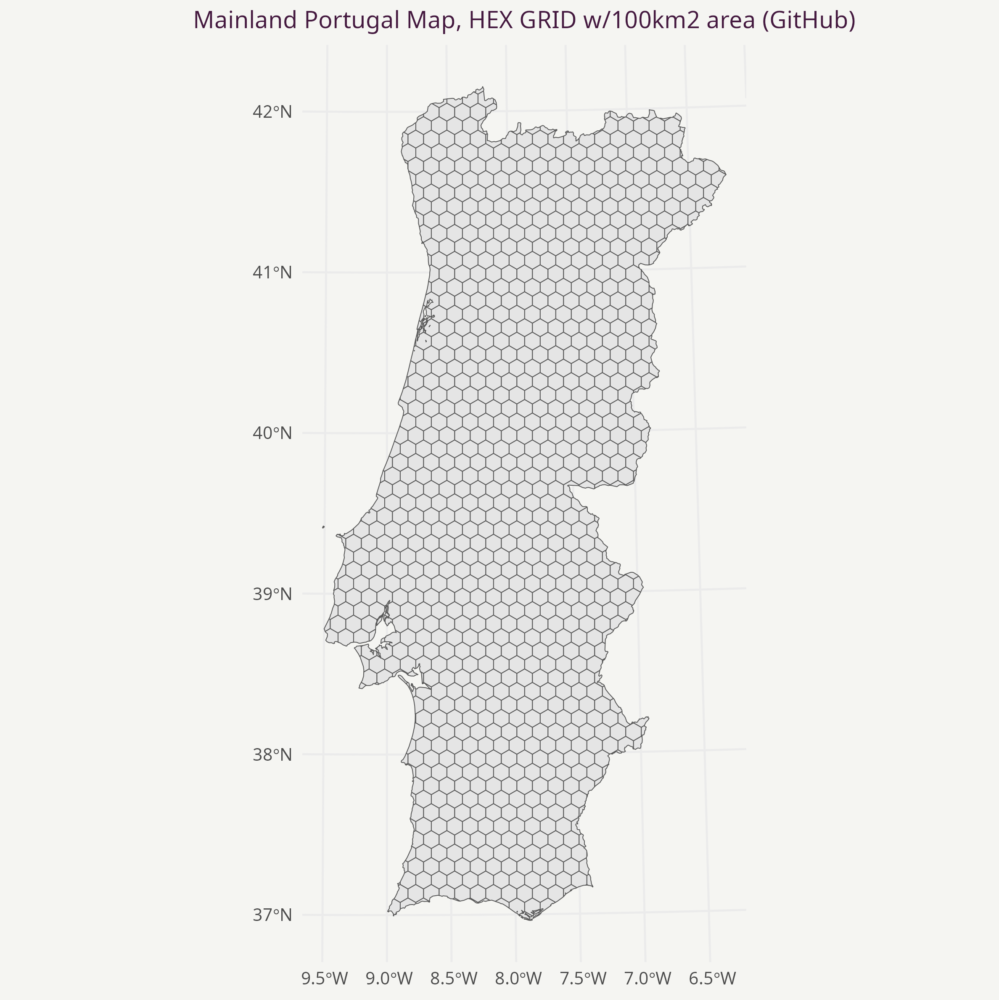
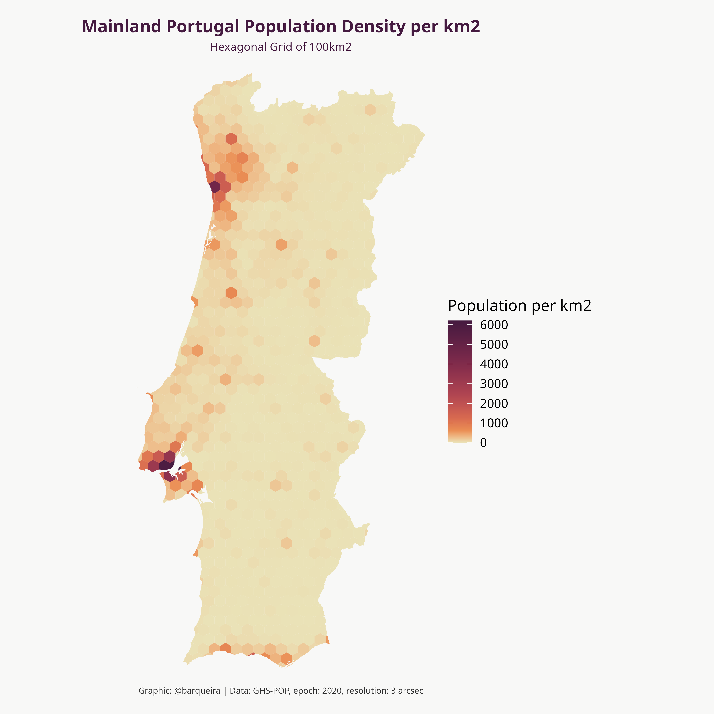

The content presented in this repo will be used in a future package (still under development). 

### Repo Structure: ###

- __maps__: include hex map of Mainland Portugal, cropped by Mainland geometry (border), with 100 km2 area for each (not all) hex polygon.
  
  - hex_cropped_portugal_100km2.gpkg
  
  - Other maps are present for reusability in other projects:
    
    - hex_cropped_portugal_25km2.gpkg, same as above but with 25km2 area for each (not all) hex polygon  

    - square_cropped_portugal_100km2.gpkg, now with square grids with 100km2 area for each (not all) square polygon  

- __data__: __data__ is strictly related with __map__ (Gridded map of Mainland Portugal in hexagons of about 100 km2), through the variable __grid_id__ which is present in both files. Data was worked out based on the grid of the map
  - __population__: human_pop_density.csv [GHSL - Global Human Settlement Layer](https://human-settlement.emergency.copernicus.eu/download.php?ds=pop), variables ("grid_id"  "population_km2")

- __scripts__ (R code to generate __maps__ and __data__):
  
  - __hex_map_100.r__: R code to generate hexagonal map of Mainland Portugal, cropped by Mainland geometry (border), with 100 km2 area for each (not all) hex polygon. The output of this script is present on the folder __maps__.  

  - __hex_map_25.r__: R code to generate hexagonal map of Mainland Portugal, cropped by Mainland geometry (border), with 25 km2 area for each (not all) hex polygon. The output of this script is present on the folder __maps__. 

  - __square_map_100.r__: R code to generate square map of Mainland Portugal, cropped by Mainland geometry (border), with 100 km2 area for each (not all) hex polygon. The output of this script is present on the folder __maps__. 

  - __data_wrangling_population.r__: R code to generate Human population density per km2.

- __vignettes__: practical examples to help users get the most out of this containts. 
  
  - __get_map.r__: R code to implement __get_map()__, a function that loads hex gridded map of Mainland Portugal with 100km2 area for each (not all) hex polygon, __from GitHub__
  
  - __get_layer.r__: R code to implement __get_layer(layer)__, a function that loads a .csv file with columns grid_id and the layer to analyse (population per km2, ...), the results from files on the __scripts__ directory.
    - layer = "human", human population per km2
    - layer = 
    - layer = 
    - layer = 

  - __population.r__: R code exemplifying the application of functions __get_map()__ and __get_layer(layer)__, to layer = "human" (population per km2)  

__Note:__ This repository is inspired by the work carried out by __Benjamin Nowak (@BjnNowak)__  

### Plots from vignettes ###

__Script file: get_map.r__  

__Script file: population.r__  

