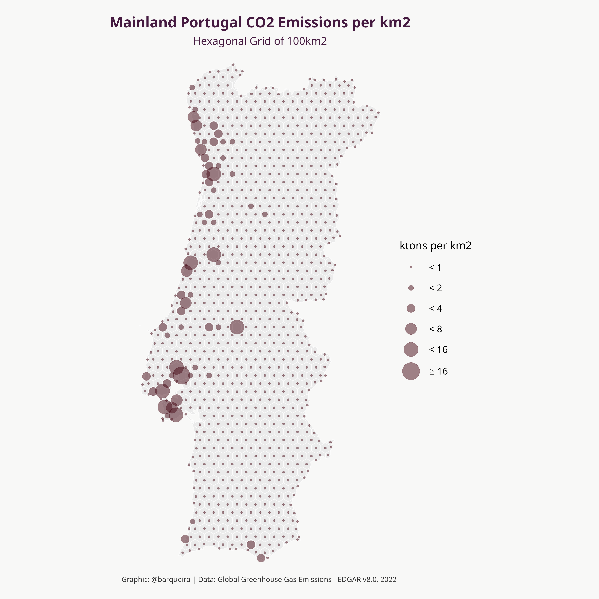
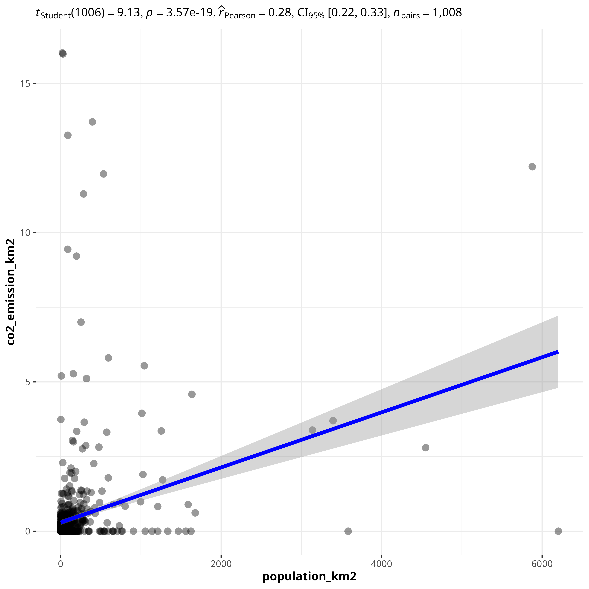

The content presented in this repo will be used in a future package (still under development). 

### Repo Structure: ###

- __maps__: 
  
  - __hex_cropped_portugal_100km2.gpkg__, hex map of Mainland Portugal, cropped by Mainland geometry (border), with 100 km2 area for each (not all) hex polygon
  
  - __Other maps__ are present for reusability in other projects:
    
    - hex_cropped_portugal_25km2.gpkg, same as above but with 25km2 area for each (not all) hex polygon  

    - square_cropped_portugal_100km2.gpkg, now with square grids with 100km2 area for each (not all) square polygon  

    - square_uncropped_portugal_100km2.gpkg, square grid with 100km2 area for each square polygon, not cropped by the Mainland Portugal geometry (border)  

    - utm10+ilhas.gpkg, downloaded from [Atlas of Mammals in Portugal, GitHub Repo](https://github.com/AMBarbosa/AtlasMamPor/tree/master/mapas)

- __data__: strictly related with __map__ (Gridded map of Mainland Portugal in hexagons of about 100 km2), through the variable __grid_id__ which is present in both files. Data was worked out based on the grid of the map
  
  - __population__: human_pop_density.csv, [GHSL - Global Human Settlement Layer](https://human-settlement.emergency.copernicus.eu/download.php?ds=pop), variables ("grid_id"  "population_km2")

  - __co2_emission__: co2_emissions_density.csv, [Global Greenhouse Gas Emissions - EDGAR v8.0](https://edgar.jrc.ec.europa.eu/gallery?release=v80ghg&substance=CO2&sector=TOTALS), variables ("grid_id"  "co2_emission_km2")

- __scripts__ (R code to generate __maps__ and __data__):
  
  - __hex_map_100.r__: R code to generate hexagonal grid map of Mainland Portugal, __cropped__ by Mainland geometry (border), with 100 km2 area for each (not all) hex polygon. The output of this script is present on the folder __maps__.  

  - __hex_map_25.r__: R code to generate hexagonal grid map of Mainland Portugal, __cropped__ by Mainland geometry (border), with 25 km2 area for each (not all) hex polygon. The output of this script is present on the folder __maps__. 

  - __square_map_100.r__: R code to generate square grid map of Mainland Portugal, __cropped__ by Mainland geometry (border), with 100 km2 area for each (not all) square polygon. The output of this script is present on the folder __maps__. 

  - __square_uncropped_map_100.r__: R code to generate square grid map of Mainland Portugal, __uncropped__ by Mainland geometry (border), with 100 km2 area for each square polygon. The output of this script is present on the folder __maps__. 

  - __data_wrangling_population.r__: R code to generate Human population density per km2.

  - __data_wrangling_co2_emissions.r__: R code to generate CO2 emission density in ktons per km2.

- __vignettes__: practical examples to help users get the most out of this repo. 

  - __plot_map.r__: R code that uses __get_map()__ function to load hex gridded map of Mainland Portugal with 100km2 area for each polygon (not all - because is cropped by Mainland Portugal geometry), and creates the respective plot;
  
  - __get_layer.r__: R code to implement __get_layer(layer)__, a function that loads a .csv file with columns grid_id and the layer to analyse (population per km2, ...), the results from files on the 
  __scripts__ directory.
    - layer = "human", human population per km2
    - layer = "co2", co2 emissions per km2
    - layer = 
    - layer = 

  - __population.r__: R code exemplifying the application of functions __get_map()__ and __get_layer(layer)__, to layer = "human" (population per km2)  

__Note:__ This repository is inspired by the work carried out by __Benjamin Nowak (@BjnNowak)__  

### Plots from vignettes ###

__Script file: plot_map.r__  

__Script file: population.r__  

__Script file: co2_emissions.r__  

__Script file: correlation.r__  

